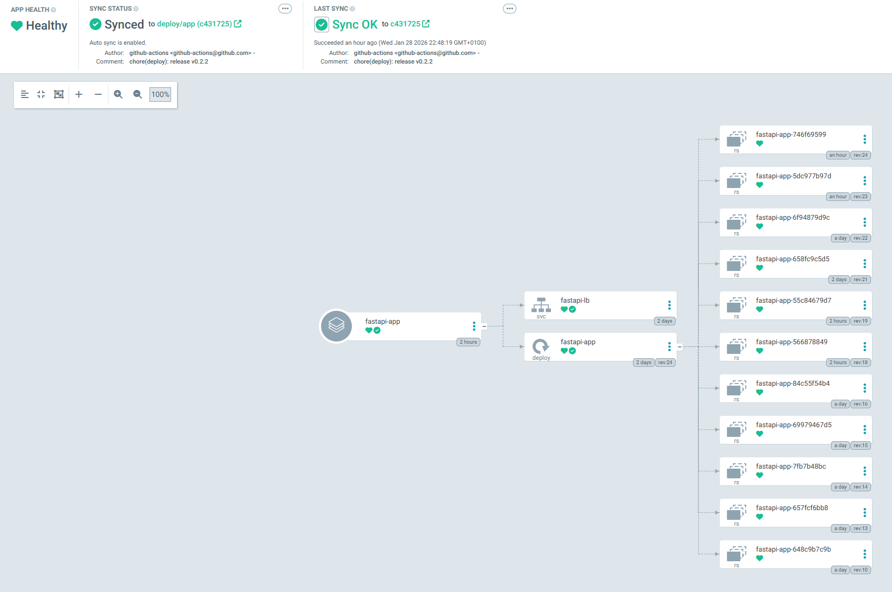
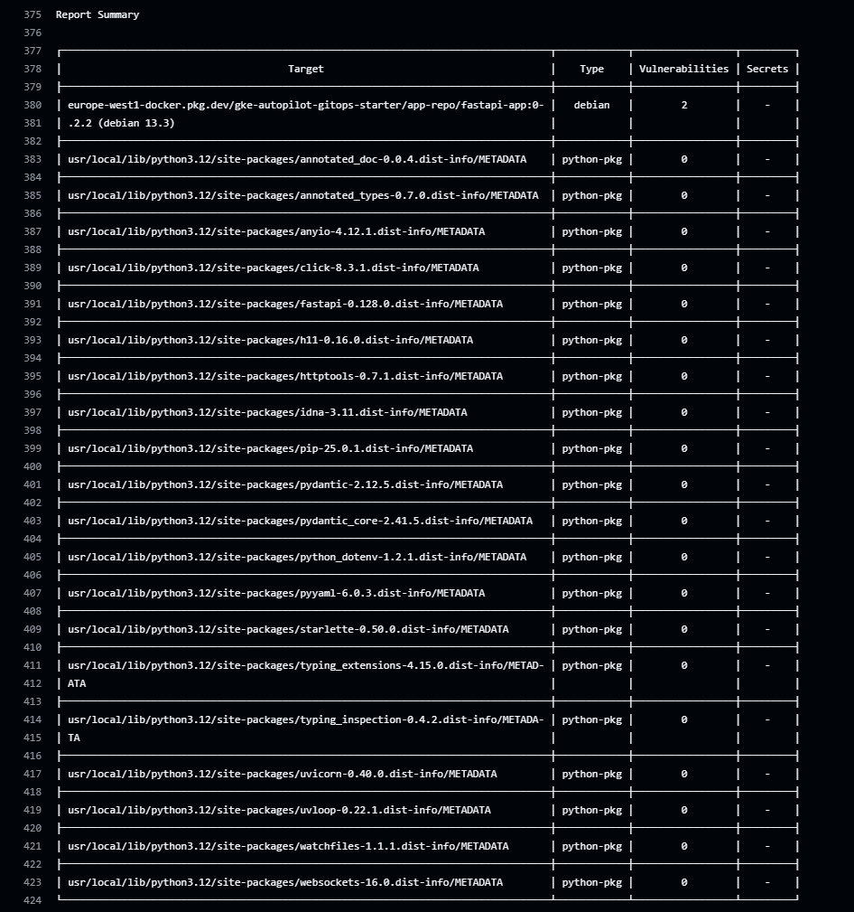
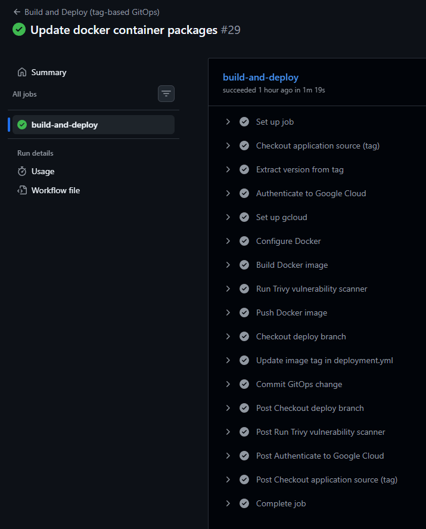
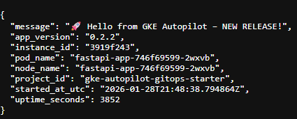

# GKE Autopilot GitOps Demo

This repository shows **how a modern GitOps-based deployment flow works in practice** using Google Cloud Platform.

The main goal of this project was **learning and understanding the full process**, not building a complex application:
- how infrastructure is provisioned
- how CI builds and releases applications
- how Git becomes the single source of truth
- how ArgoCD reacts to Git changes

---

## 🚀 Quick Links to Core Components

- 🏗️ [Infrastructure (Terraform)](./terraform/)
- ⚙️ [CI Pipeline (GitHub Actions)](./.github/workflows/deploy.yml)
- ⚓ [CD Configuration (ArgoCD)](./argocd/application.yml)
- 📦 [Kubernetes Manifests (GitOps State)](./k8s/)

---

## 🧠 What this project demonstrates

- Infrastructure provisioning with **Terraform**
- Kubernetes deployment on **GKE Autopilot**
- Container image lifecycle with **Artifact Registry**
- GitOps-based delivery with **ArgoCD**
- Tag-based releases using **GitHub Actions**
- Clear separation between:
  - application development
  - deployment state
  - cluster runtime

---

## 🛠 Tech stack

- **Cloud:** Google Cloud Platform (GCP)
- **Infrastructure as Code:** Terraform
- **Kubernetes:** GKE Autopilot
- **Application:** FastAPI (Python)
- **CI:** GitHub Actions
- **CD / GitOps:** ArgoCD
- **Container Registry:** Google Artifact Registry
- **Security:** Workload Identity, Trivy
- **Ingress & TLS:** GCE Ingress + Google Managed Certificates

---

## 🗂 Repository structure

```text
.
├── app/                    # FastAPI application
│   ├── Dockerfile
│   ├── main.py
│   └── requirements.txt
│
├── argocd/                 # ArgoCD configuration
│   ├── application.yml
│   ├── project.yml
│   ├── ingress/
│   │   ├── ingress.yml
│   │   └── certificate.yml
│   └── namespaces/
│       └── argocd.yml
│
├── k8s/                    # Application manifests (GitOps state)
│   ├── deployment.yml
│   ├── service.yml
│   ├── hpa.yml
│   ├── configmap.yml
│   └── namespaces/
│       └── app.yml
│
├── terraform/              # GCP infrastructure
│
├── .github/workflows/      # CI pipelines
│   └── build-and-deploy.yml
│
└── README.md

```

## 🌱 Branching model

The repository uses a simple and explicit branching strategy.

### `develop`
- Developers work here
- Application code changes only
- No deployments from this branch

### `main`
- Stable application code
- Changes are merged here from `develop`
- Only this branch is tagged

### `deploy/app`
- GitOps-only branch
- Contains Kubernetes manifests
- Watched by ArgoCD
- Never edited manually

---

## 🔄 Deployment flow (step by step)

1. Developer works on the application in the `develop` branch
2. When ready, `develop` is merged into `main`
3. A release tag is created on `main`:

   ```bash
    git tag v0.2.2
    git push origin v0.2.2
    ```

## 🔄 Deployment flow

The tag triggers **GitHub Actions**.

CI pipeline:
- builds Docker image from the tagged code
- scans the image with **Trivy**
- pushes the image to **Artifact Registry**
- updates `k8s/deployment.yml` in `deploy/app`
- commits and pushes the change

**ArgoCD** then:
- detects a new commit on `deploy/app`
- synchronizes the cluster automatically

➡️ The cluster changes **only because Git changed**.

---

## ☸ Kubernetes & ArgoCD

- Cluster type: **GKE Autopilot**
- Ingress: **GCE Ingress**
- TLS: **Google Managed Certificates**
- ArgoCD Auto-Sync enabled

The application uses:
- Deployment
- Service
- ConfigMap
- Horizontal Pod Autoscaler

ArgoCD watches only the `deploy/app` branch, which keeps:
- deployment logic out of CI
- runtime state fully declarative
- clear audit history in Git

---

## 🔐 Security considerations

- No Kubernetes credentials stored in CI
- Authentication to GCP via **Workload Identity**
- Image vulnerability scanning with **Trivy**
- TLS enabled for ArgoCD UI
- Minimal IAM permissions

---

## 📸 Evidence of Work

This section contains screenshots that show the GitOps flow working end to end.

---

### 1️⃣ ArgoCD – Application Resource Tree

This screenshot shows the ArgoCD application view and the current state of the cluster.

You can see how ArgoCD manages and keeps in sync:

- Deployment  
- Service  
- Horizontal Pod Autoscaler  
- Pods created by the Deployment  

All resources are **Synced** and **Healthy**, and the application is managed from the `deploy/app` branch.



---

### 2️⃣ DevSecOps – Trivy Vulnerability Scan

Every image built by the pipeline is scanned before it is pushed.

This screenshot shows **Trivy** running during the CI job and reporting vulnerabilities found in the Docker image.  
Only high and critical issues are checked.



---

### 3️⃣ GitHub Actions – Tag-based GitOps Pipeline

This screenshot shows a successful GitHub Actions run triggered by a Git tag.

The pipeline:

- builds the Docker image from tagged source code  
- scans the image with Trivy  
- pushes the image to Artifact Registry  
- updates the Kubernetes manifest in the `deploy/app` branch  
- commits the change back to Git (GitOps write-back)  



---

### 4️⃣ Live Application Response

This screenshot shows the response from the running application.

The response includes:

- application version  
- pod name  
- instance identifier  
- uptime information  

This confirms that the deployment, load balancing and GitOps flow are working correctly.



---

## 🎯 What I learned from this project

- How GitOps changes the way deployments are handled  
- Why separating code and deployment state matters  
- How ArgoCD reacts to Git commits, not CI jobs  
- How tag-based releases simplify versioning  
- How GKE Autopilot removes operational overhead  

---

## ✅ Project status

The project reached its intended goal:  
**a fully working GitOps flow that is easy to understand and reason about.**

Further improvements are possible, but intentionally out of scope.

---

## 📄 License

This project is licensed under the **MIT License**.

You are free to use, copy, modify and distribute this project for learning or personal purposes.  
No warranty is provided.

See the [LICENSE](LICENSE) file for details.


